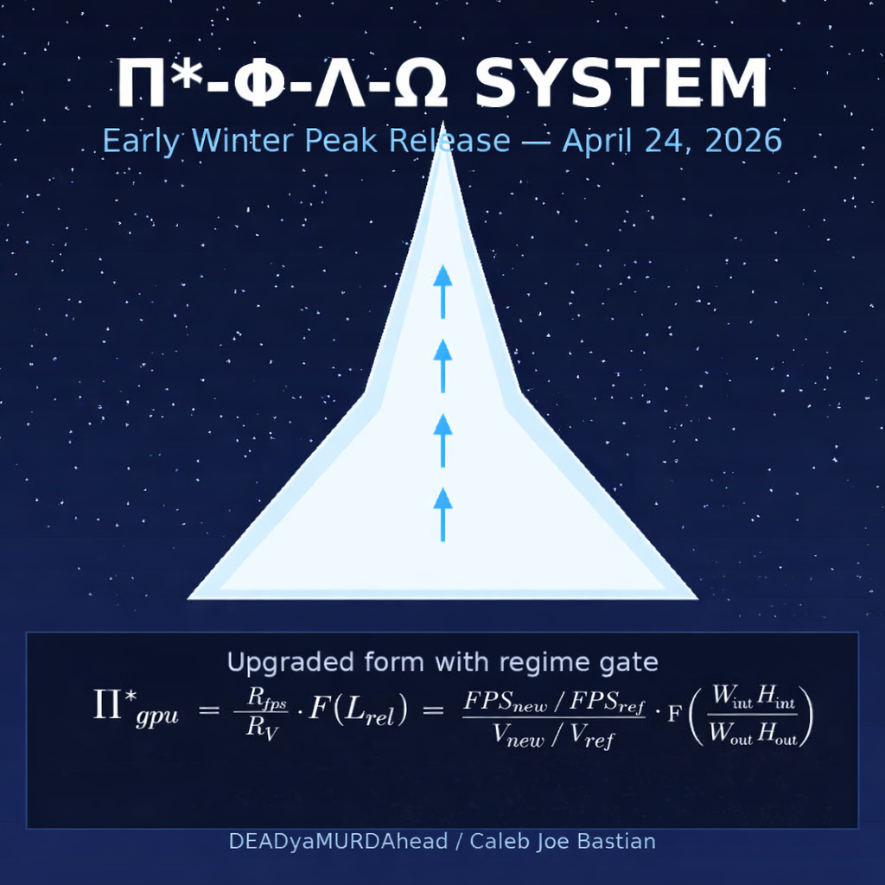

  
 <p
# Π*‑Φ‑Λ‑Ω SYSTEM — v1.0 (Math Revealed)

**A Unified Model of Performance Stability, Lock‑In, and Post‑Render Dynamics**

**Author:** DEADyaMURDAhead / Caleb Joe Bastian
**Version:** 1.0
**Date:** April 24, 2026

---

### 1. Overview

The Π*‑Φ‑Λ‑Ω System proposes a unified conceptual framework describing how CPU and GPU workloads interact across stability zones, lock‑in behavior, and post‑render dynamics. It proposes a dimensionless, hardware-agnostic method for analyzing performance ceilings, efficiency scaling, collapse zones, internal resolution behavior, CPU/GPU flow balance, and tuning stability.

This system is intended for application across games, engines, and hardware generations.

---

### 2. Core Components

- **Π*** — Efficiency Index: dimensionless ratio of performance gain to voltage cost
- **Φ** — Flow: throughput of the CPU→GPU→Render pipeline
- **Λ** — Lock‑In Zone: the operating mode where Π*·Φ stabilizes
- **Ω** — Stability Envelope: the permissible region defined by resolution scaling and headroom

---

### 3. System Intent

The system provides a unified language, a dimensionless model, a predictive structure for internal resolution tuning, and a framework for identifying stability zones. It is not tied to any specific game or vendor.

---

### 4. Π* — Efficiency Index

Π* is the central metric.

**GPU form (proposed):**
Π*_gpu = (f_vram / f_vram,ref) × (Δf_core / Δf_core,ref) × (R_out / R_out,ref) / (ΔV / ΔV_ref)

**CPU form (proposed):**
Π*_cpu = (f_t / f_r) × (V_r / V_t) × (P_t / P_r) × (W_r / W_t)

Π* is dimensionless, increases in the Goldilocks zone, and saturates at the GPU ceiling.

*Note on voltage: Π* uses ΔV as a practical tuning proxy, not as a physical energy metric. True dynamic power scales with V² (P ≈ C·V²·f), so performance-per-watt would require multiplying Π* by (V_ref/V). ΔV is retained here because it is directly controllable in overclocking and correlates with stability headroom.*

---

### 5. Φ — Flow Dynamics
Φ = Flow_t / Flow_ref  (proposed)

High Φ = consistent pacing, minimal stalls. Low Φ = CPU stalls, GPU starvation. Φ determines how well Π* can be maintained.

---

### 6. Λ — Lock‑In Behavior
Λ = Π* × Φ  (proposed)

- Λ_CPU: CPU-bound, Π* suppressed
- Λ_GPU: GPU-bound, Π* stable
- Λ_Hybrid: transitional, unstable scaling

---

### 7. Ω — Stability Envelope

Ω is satisfied when all three hold:
1. Aspect: W_out / H_out ≈ W_int / H_int
2. Scale: 1.5 ≤ S ≤ 2.0 where S = W_out / W_int
3. Headroom: β = (W_int × H_int) / (W_out × H_out) ≤ 0.45

---

### 8. Goldilocks Zone

The range where Π* is maximized, Φ is smooth, Λ is GPU-dominant, and Ω conditions are met. Initial testing suggests this occurs near β ≈ 0.25–0.45.

---

### 9. Collapse Zones

Collapse occurs when Ω is violated: CPU thread saturation, excessive β, VRAM pressure, or scene spikes cause transition to Λ_CPU.

---

### 10. Internal Resolution Scaling

Independent third-party reviewer data (n=6 titles, 2021–2024) report FPS gains of 1.66× to 2.53× (mean 1.99×) at β ≈ 0.25–0.40, consistent with the proposed Ω envelope. These figures correspond to common temporal/spatial upscaling presets (commonly labeled Balanced to Performance).
FPS_tuned / FPS_ref ≈ 1.5–1.9×  at β ≈ 0.35–0.45

This corresponds to observed scaling at reduced internal resolution, with improved Π* and stabilized Ω.

---

### 11. CPU/GPU Flow Model

CPU → Φ → GPU → Render → Output

CPU determines Λ mode, Φ determines throughput, GPU determines Π*, Ω determines stability.

---

### 12. CPU Efficiency Mirror

The CPU follows the same progression. Its Λ-ridge occurs where ∂Π*/∂L = 0 where L = applied load — the point where thermal, voltage, and scheduler limits intersect. Beyond this, the system enters Ω-state: post-load equilibrium.

Optimal operation occurs sub-critically, just below the Λ-ridge, where Π* is maximized before voltage and thermal costs dominate. This corresponds to the untuned CPU state observed in initial testing.

---

### Glossary

**Π*** — Dimensionless efficiency index (see Section 4)
**Φ** — Flow ratio (Section 5)
**Λ** — Lock-in product Π*·Φ (Section 6)
**Ω** — Stability envelope defined by aspect, scale, and β ≤0.45
**β** — Resolution ratio (W_int·H_int)/(W_out·H_out)
**f_vram** — VRAM effective frequency
**Δf_core** — core clock delta from baseline
**R_out** — output resolution pixel count
**ΔV** — voltage delta
**f_t/f_r** — test/reference CPU frequency
**P_t/P_r** — power draw
**W_t/W_r** — work units completed
**Goldilocks Zone** — β range where Π* peaks and Ω holds
**Collapse Zone** — region where Ω fails

*Symbols chosen for mnemonic value within this framework, not to imply physical constants.*

---

### Appendix A — Example Behavior

**Configuration:** 3200×900 → 1600×448 (β=0.249, S=2.0, aspect ≈ matched)
*Note: 1600×448 is the internal render target acting as the control arm; it is not a perfect 50% scale, which is why Ω uses "≈" for aspect matching rather than strict equality.*

---

### Appendix A — Example Behavior

**Configuration:** 3200×900 → 1600×448 (β=0.249, S=2.0, aspect ≈ matched)  
*Note: 1600×448 is the internal render target; Ω uses "≈" for aspect matching.*

- **At 0.5×:** GPU load ↓, Π* ↑, Φ smooth, Ω stable (Run A: 192 FPS, 49% GPU, 46°C)
- **At 1.0×:** GPU saturates, Λ→GPU, Ω narrows (Runs B/C: ~150 FPS, 89% GPU)

---
### Appendix B — Tuning Methodology

1. Start native
2. Lower until Π* rises
3. Identify Ω-satisfying β
4. Confirm Φ
5. Validate Ω under load
6. Document Λ transitions

---
### Appendix C — Universality & Limitations

- Engine-agnostic, hardware-agnostic, resolution-agnostic
- **Validated on:** desktop DirectX 12 / Vulkan titles only
- **Not modeled:** frame-generation latency, driver-level scheduling
- **Voltage note:** Π* uses ΔV as a tuning proxy. True power ∝ V², so performance-per-watt = Π* × (V_ref/V)

---

### Version

**v1.0 — April 24, 2026**  
**Author:** DEADyaMURDAhead / Caleb Joe Bastian
